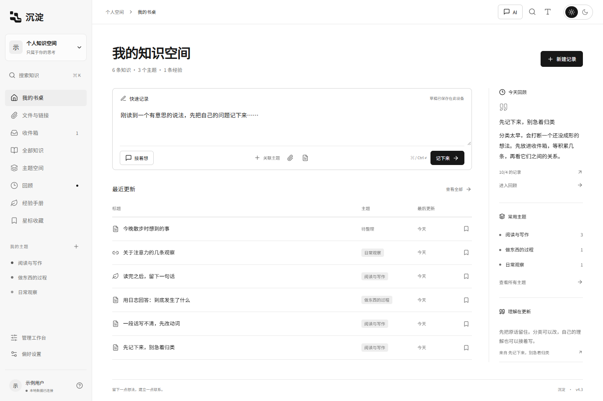
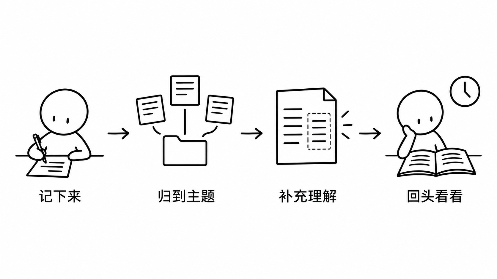
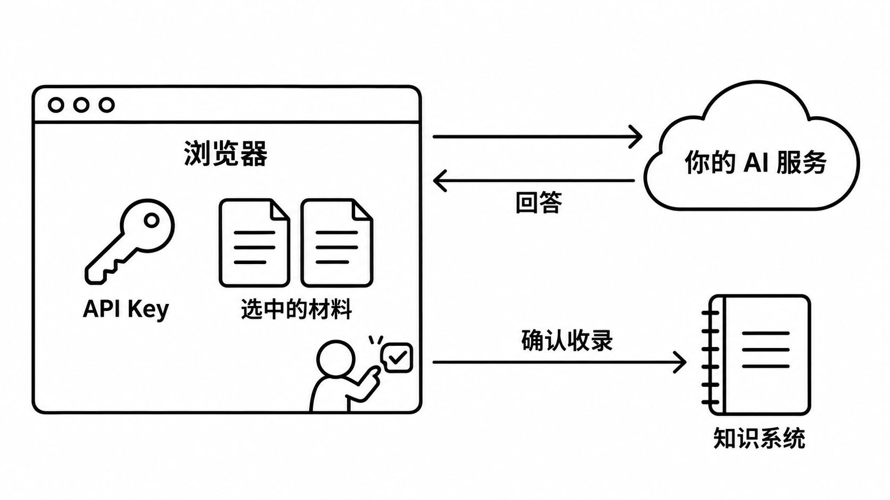

<div align="center">

<a name="top"></a>
<h1>沉淀</h1>
<p><strong>先记下来，再慢慢想明白。</strong></p>

<p>
  <a href="package.json"></a>
  <a href="LICENSE"></a>
  <a href="https://github.com/mitang-ai/knowledge-system/actions/workflows/checks.yml"></a>
  <a href="https://github.com/mitang-ai/knowledge-system/stargazers"></a>
</p>

<p>
  <a href="https://zhishi.51wanai.com"></a>
  <a href="#快速开始"></a>
  <a href="#浏览器插件"></a>
</p>

<p><a href="#用自己的-ai">AI 接入</a> · <a href="#接给其他程序">API / MCP</a> · <a href="#文档与反馈">文档与反馈</a></p>

</div>

**沉淀**是一套可以自己部署的知识工作空间。随手记点东西，整理读过的资料，隔几天再回来补充。原文在，理解怎么变的也在。

不用先想标题，也不用立刻分好类。写下来就行。

<p align="center">
  
</p>
<p align="center"><sub>本地运行截图，笔记为示例内容。深浅色、字体和阅读宽度都能调整。</sub></p>

## 记下之后呢？

| 想做的事 | 在沉淀里 |
| :--- | :--- |
| 把刚冒出来的想法留下 | 无标题随手记，草稿自动留在设备上。没整理的先放收件箱。 |
| 留住读过的材料 | 保存链接、文件和出处。一条记录可以关联多个主题，不用复制几份。 |
| 把理解接着写下去 | 写补充，选一条作为当前理解；原文、编辑版本和理解历史都能回看。 |
| 隔段时间再遇见它 | 给记录安排回顾，也可以星标、归档，或整理成自己的经验手册。 |
| 和别人一起积累 | 个人空间与团队空间分开，成员按角色读写。加入团队不会开放个人记录。 |
| 带走自己的内容 | 支持 Markdown、JSON、ZIP 导出，还有回收站、备份和恢复。 |

<p align="center">
  
</p>

这是一种用法，不是必须走完的流程。只拿它当随手记，也可以。

## 快速开始

需要 **Node.js 22.13+ 或 24+**、**Python 3.11+**。核心服务只用 Python 标准库。

```bash
git clone https://github.com/mitang-ai/knowledge-system.git
cd knowledge-system
npm ci
npm run build
python scripts/start.py
```

打开 [http://127.0.0.1:8787](http://127.0.0.1:8787)。保持终端运行，按 `Ctrl+C` 停止。Windows PowerShell 若拦截 npm 脚本，改用 `npm.cmd`。

本地首次启动是个人模式。需要登录时，在「偏好设置 → 账号与空间」启用；已有内容归属这个账号，之后的新用户各有自己的空间。[更多启动方式与部署说明 →](docs/运行与部署.md)

> [!IMPORTANT]
> 在线站点可用「一键创建账号密码」。创建后先复制或下载保存卡，确认保存再进入。自动生成的账号不是邮箱，不能收邮件；丢失账密可能无法找回。

## 浏览器插件

**沉淀 · 随手记**适用于 Chrome 116+ 和支持侧边栏的新版 Edge。看网页时就能记，不必来回切窗口。

| 操作 | 快捷键 |
| :--- | :--- |
| 记一个想法 | <kbd>Alt</kbd> + <kbd>Shift</kbd> + <kbd>N</kbd> |
| 沉淀当前网页或选中文字 | <kbd>Alt</kbd> + <kbd>Shift</kbd> + <kbd>S</kbd> |
| 提交编辑器里的记录 | <kbd>Ctrl</kbd> / <kbd>⌘</kbd> + <kbd>Enter</kbd> |

右键菜单也能采集。原始材料、自己的想法和 AI 整理分开保留；断网时先进入本机队列，拿到系统记录 ID 后才显示已保存。

```bash
npm run build:extension
```

打开 `chrome://extensions` 或 `edge://extensions`，启用开发者模式，加载 **`build/browser-extension/unpacked`**。在插件设置里连接自己的知识空间，按需要批准写入权限。

目前是**本地加载版，未上架商店**。X、Reddit 只采集已加载内容；图片保存的是来源链接，不是附件归档。安装、授权和采集限制见 [插件使用说明](extension/README.md)。

## 用自己的 AI

AI 可用，也可以不用。没有 Key，记录、整理和回顾照常工作。

1. 在「偏好设置 → AI 与模型」填自己的地址和 Key，选择 OpenAI 兼容协议或 Anthropic。
2. 探测模型目录，勾选常用模型，设一个默认值。每次任务只用当前选中的一个模型，切换不用重填配置。
3. 打开 AI 侧栏，选好要发送的材料。聊一聊、做摘要或分析，有用的部分修改后再收录。

<p align="center">
  
</p>

**Key 不交给沉淀服务器。** 它可留在当前浏览器会话，也可由你选择记住此设备。所选材料和 Key 会发给你填的 AI 服务，调用可能计费；浏览器存储本身不是加密保险箱。

接口需要允许浏览器跨域访问，失败时不会改走系统服务器。文字 PDF、DOCX、文本文件可以先在浏览器读取；网页读不到，就粘贴正文。不会只拿一个 URL 假装读完了全文。

长文先确认分段调用。知识库对话由你选择来源，不自动把全库发出去。[AI 接入与限制 →](docs/AI接入说明.md)

## 接给其他程序

自己的脚本和 Agent，也能接着用这些知识。

| 入口 | 适合做什么 | 继续看 |
| :--- | :--- | :--- |
| **REST API · `/api/v1`** | 按授权范围搜索、读取、写入，处理修订与增量变化 | [OpenAPI](docs/openapi-v1.json) |
| **Python SDK / CLI / MCP** | 把知识接给自己的 Agent，提交整理建议或执行已批准的任务 | [接入说明](docs/开放知识与连接器.md) |
| **捕获包 / JavaScript SDK** | 让其他程序生成采集包，导入插件，或通过范围 API 提交 | [插件开发契约](docs/浏览器插件开发与验收.md) |

授权默认只读。Agent 的整理先进入待采纳区，直接写入要另开权限和每日额度。可读内容、历史、附件分别选择，也能撤销授权。

本地连接器支持 Obsidian、飞书和 ima。飞书、ima 目前通过的是合成协议测试，接真实账号还需配置、验证。远程 MCP 也要单独部署，网站上线不等于 MCP 已经对外开放。

## 部署与数据

**公开仓库不带任何已有用户、知识、附件或运行数据库。** 本地运行数据默认在 `server/storage/`，已排除在 Git 之外。

生产模式需要 HTTPS、反向代理和离线配置的所有者账号。别把本地个人模式直接暴露到公网。邮件验证与找回目前没有实现；公开运营还要自己配置限流、监控和备份。

<details>
<summary><strong>更新、迁移与备份时要留意什么？</strong></summary>

- 更新代码时保留现有存储目录，不用空库替换。可用 `SEDIMENT_STORAGE` 指向独立目录。
- 整实例迁移先停服务，再复制完整存储目录，避免漏掉 SQLite WAL。导入、恢复和永久删除前先备份。
- 外部种子只能在空实例首次启动前，通过 `SEDIMENT_SEED_DIR` 指向仓库外目录。结构为 `ks_items.json`、`ks_replies.json`、`ks_profiles.json`，只初始化一次，不要提交真实文件。
- AI 配置不跟随知识备份迁移。换设备需要重新填写，卸载插件前也要另存设备草稿。

[运行与生产部署](docs/运行与部署.md) · [一键账号与发布说明](docs/一键账号与发布.md)

</details>

<details>
<summary><strong>开发目录与检查命令</strong></summary>

| 目录 | 内容 |
| :--- | :--- |
| `src/` | 知识界面、浏览器 AI、连接与迁移 |
| `server/` | 核心 API、SQLite、账号权限、OAuth、任务 |
| `extension/` | MV3 侧边栏、采集、设备草稿、同步队列与 SDK |
| `sediment/` | Python SDK、CLI、MCP、本地连接器 |
| `skills/` | Agent Skills，不包含密钥或额外权限 |
| `tests/` | 合成数据、协议与浏览器检查 |

```bash
npm run build
npm run test:ai
npm run typecheck:extension
python -m pip install -e ".[test]"
npm test
```

`test:ai` 当前运行全部 Vitest 测试，包括账号和插件模块。浏览器检查使用隔离数据；配置和命令见 [验证记录](docs/验证记录.md)、[插件开发与验收](docs/浏览器插件开发与验收.md)。Windows 的旧 Python 套件可能遇到符号链接权限、编码或临时 SQLite 文件占用问题，不能把部分通过当成全量通过。

字体与 PDF 资源在构建时准备，部署后不依赖远程字体 CDN。截图复现方式见 [README 素材说明](docs/readme/README.md)。

</details>

## 文档与反馈

| 使用沉淀 | 接入与开发 |
| :--- | :--- |
| [产品与功能](docs/设计与功能说明.md) | [开放知识与连接器](docs/开放知识与连接器.md) |
| [AI 接入](docs/AI接入说明.md) | [系统扩展契约](docs/扩展开发契约.md) |
| [浏览器插件](extension/README.md) | [插件设计与开发](docs/浏览器插件设计与调研.md) |
| [运行与部署](docs/运行与部署.md) | [验证记录](docs/验证记录.md) |

有问题就 [开个 Issue](https://github.com/mitang-ai/knowledge-system/issues/new)。说清做了什么、预期是什么、实际看到了什么；日志记得去掉密码、Key 和私有内容。

欢迎修问题、补文档、加连接器。改实现前先看对应模块的契约，不混入运行数据。觉得用得上，留个 [Star](https://github.com/mitang-ai/knowledge-system/stargazers) 就好。

<div align="center">
  <sub><a href="LICENSE">MIT</a> · 你的记录，你的模型，你的存储。</sub><br>
  <sub><a href="#top">回到顶部 ↑</a></sub>
</div>
