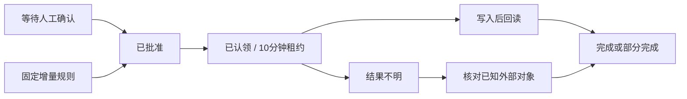

# 开放知识扩展开发契约 · v4.3

扩展通过用户授权的 `/api/v1` 访问知识。网页、SDK、CLI、MCP 和连接器共用服务端权限判定；客户端不读取 SQLite，不绕过人工采纳或外发审批。完整接口见 [OpenAPI](openapi-v1.json)，操作示例见 [连接器说明](开放知识与连接器.md)。

## 模块边界

| 模块 | 责任 |
| --- | --- |
| `server/app.py` | 原有账号、团队、知识保存、附件、备份与 HTTP 服务 |
| `server/kbase.py` | 保存事务中的事件投影、不可变修订、稳定片段、持久化队列 |
| `server/access.py` | Agent 身份、范围及字段权限、当前团队角色、游标绑定 |
| `server/knowledge.py` | 搜索、精确读取、历史、知识包、增量、实践验证 |
| `server/transfers.py` | 待采纳、固定外发计划、审批、租约、回执、预授权规则 |
| `server/oauth.py` | 公开客户端注册、S256 PKCE、资源绑定、令牌轮换与撤销 |
| `sediment/client.py` | SDK HTTP 边界、来源地址、错误、响应预算与禁止重定向 |
| `sediment/mcp_server.py` | 官方 SDK 的 stdio / Streamable HTTP 工具与资源 |
| `sediment/runner.py` | 本地凭证、执行锁、账本、检查点、心跳、回读、外部修改建议 |
| `sediment/connectors/` | 目的地适配器；不持有源服务的管理权限 |
| `src/connect/` | 范围授权、审批、提取、目的地、规则、审计与验证界面 |

前端自己的模型仍由 `src/ai/` 从浏览器直连。不要为兼容模型跨域新增核心代理；不要把模型 Key、目的地 Secret 或真实访问令牌加入配置、知识包、备份或日志。

## API 与身份

Agent 请求必须带 `Authorization: Bearer …`。无令牌不会回退为本地所有者；带令牌的请求不能改走旧 `/api` 获得所有者能力。网页使用交互会话；无账号本地模式需明确的交互请求头，写请求仍核验 Origin。生产模式关闭匿名回退，需要预置所有者及 HTTPS 公共地址。

可分别授予阅读、历史、附件、增量、建议、外发准备、执行和限额直接写入。读取字段也分别授权：`original`、`current_understanding`、`replies`、`experience`、`validation`、`provenance`、`history`、`attachment_metadata`。历史和附件必须同时具备对应字段与 scope。

范围由空间、主题、精确条目和排除项组成。默认捕获已有条目；只有明确开启 dynamic_membership 才包括未来条目。服务每次访问重新核验账号、授权、当前角色、当前条目空间及团队外部策略。平台管理员不因此获得个人正文访问权。

响应附 `schema_version: sediment.api.v1` 与随机 `request_id`；知识包使用独立的 `sediment.knowledge-package.v1`。OpenAPI 文档和二进制附件不包装。失败响应为：

```json
{"schema_version":"sediment.api.v1","request_id":"OPAQUE_ID","error":{"code":"revision_conflict","message":"…"}}
```

不可见对象返回 not_found；不要暴露它的标题、命中数、作者、变更序号或来源关系。分页只包含授权候选。游标是不透明句柄及签名，绑定身份、类型、筛选、相关权限状态与有效期；收到 `cursor_invalid` 应重新开始。不得解析它来推算全站活动。

请求上限 2 MB，分页上限 100，提取正文上限 100,000 字符，授权每分钟最多 120 次计入审计的访问。预算不足与历史缺失会在 coverage 说明；不能把部分资料描述为全文。

新增路由必须先认证，再查可见性和字段；调用 `Identity.require/fields/visible/can_export`。不要直接把 documents 表或快照 JSON 返回给调用者。

## 修订、片段与引用

修订是某条知识在一次保存后的完整快照，包含当时原文、理解、补充、经验、验证和授权附件元信息。旧系统没有保存的补充历史不会凭空重建，迁移会标注缺失。当前授权依据当前条目判定；拥有历史权限后才可读旧修订。

原文按段落建立稳定片段。相同或一对一修改保留 ID；拆分、合并建立新片段并记录 derived_from。片段 ID 不等于内容不变，精确引用必须包含 `item_id + revision + part_id`。原文、当前理解、他人补充、个人态度、实践验证分别投影。

知识包中的 fragments 带作者、层次、真实修订、出处、文本哈希、完整性及包内 citation_id。`[S1]` 仅在该知识包内有意义。确定性 package_sha256 排除随机 snapshot_id；源修订和字段相同才有相同投影。

`source_refs` 指向实际提取的材料版本；`source_heads` 绑定提取时的当前头修订。后者用于审批和执行前冲突检测，因此可以有意提取旧版本，同时检测准备后的新修改。精确选择片段使用 POST `/extractions` 的 `snapshot_id + citation_ids`；仍要重验身份、字段、引用和头修订，不能只在客户端隐藏未选片段。

附件读取需对应范围与附件权限；历史附件使用 `item_id`、`revision` 明确所属快照。附件上限及预算由客户端控制，缺失原件需明确说明，不得用猜测的文件 ID 跨用户提取。

## 写入与幂等

Agent 默认 POST `/proposals`，支持新增记录、补充、建议理解和建议经验。修改目标时先读当前修订，提交 base_revision、出处片段与模型归属。人工审核时可以编辑。当前理解仅由原作者采纳；经验默认未验证，个人“尝试过”不会自动升级为实践支持。

POST `/write` 需额外 knowledge:write、固定动作及每日上限，目前仅新增记录和补充。授权写入不会赋予删除、替换原文或自行采纳能力。

`Idempotency-Key` 支持 proposals、write、export-plans。键按授权身份和操作隔离，同键异内容返回 409。客户端重试同一次提交需保留原键，重新编辑后用新键。API 事务提交后才报告成功。人工采纳有单独状态检查，修订冲突必须重新核对。

变化接口只返回当前获准内容，以及该授权此前已知内容的 removed 标记；不泄漏从未见过的 ID。移出、删除和撤权不等于授权连接器删除外部副本。

## 外发状态机

人工审批固定正文哈希、知识包、源头修订、目的地、target_id、版式、更新许可和模型归属。Agent 可以准备计划，不能审批自己的计划。用户也可以预授权严格范围的完整记录增量规则；规则不能自动批准 Agent 改写稿。



认领需 exports:run 与知识包所需权限，执行者定期心跳。过期 running 进入 unknown_result，不回到可重领队列。撤权或请求取消后停止后续写入；已有外部对象无法假称回滚。网络中断、进程崩溃或外部平台不支持幂等时，不承诺跨平台 exactly-once。

核心保存回执，验证级别强制为 runner_reported；核心没有外部凭证，不独立背书平台结果。read_back_verified 必须由适配器实际回读；observed_content_sha256 来自实际目标文本。正文、托管属性与引用索引分别说明，不能拿请求正文哈希伪装实际回读。

## 增加目的地适配器

从 `sediment/connectors/base.py` 的 Adapter 派生，在 `connectors/__init__.py` 注册 kind 与允许的非秘密配置字段。新增秘密字段只接受 env: / keychain: 引用，由本机解析。

| 方法 | 契约 |
| --- | --- |
| `probe()` | 检查实际可读目标，声明能力；读权限探测不等于写权限已验证 |
| `resolve(package)` | 校验已批准 destination 与 target_id 完全一致 |
| `plan(package, previous)` | 写入前检查、冲突检测、明确 create / update / create_version |
| `apply(package, previous, journal)` | 在每个不可逆阶段前后持久化检查点，保存外部对象 ID |
| `verify(package, result)` | 实际回读并比对，区分部分、失败和未知 |
| `receipt(...)` | 返回真实目标、阶段、观察哈希、验证结果与必要说明 |
| `read_back(result)` | 用已有对象核对，不重新创建；供 reconcile 和 pull 使用 |

返回 ID 后先 journal，再检查取消与继续后续阶段。对象已创建但知识库未入库时，保存对象 ID并报告阶段；禁止整体成功。敏感临时链接、上游密钥、带认证的错误正文不进入核心回执。

能力矩阵必须反映实际实现。Obsidian 支持授权附件及受冲突保护的托管更新；飞书 docx 与 Wiki 分别创建并回读，ima 正式笔记与 COS 文件入库分别处理；当前飞书和 ima 创建新版本，不覆盖、删除或上传附件原件。不要以浏览器 Cookie 或非公开网页接口代替正式 API。

本地执行锁、账本、源身份、目的地与原对象映射由 runner 统一管理。外部变化用 pull 提交待采纳补充，不能悄悄合并到原文。未知状态只能 reconcile 已知对象；缺少确认对象 ID 时交给用户核对。

增加新 kind 还需更新服务的目的地枚举与团队白名单、OpenAPI、前端配置和审核说明、能力矩阵及文档。这里保留明确的代码扩展点；不把任意 Python 插件自动加载到有权限的进程。

## 验证新扩展

使用临时数据库与合成资料，至少验证两位作者、被排除记录、团队撤权、旧修订、重复请求、外部中断、部分入库、回读差异和错误凭据脱敏。连接器测试可使用本地 HTTP 协议服务；至少验证一条完整的本地写入、账本、核心回执链路。

`tests/test_protocols.py` 使用官方 MCP SDK 实际连接 stdio 和远程 HTTP；`tests/test_connectors.py` 验证飞书／ima 协议与 Obsidian 文件；`tests/browser_connect.py` 验证网页审批、浏览器模型、OAuth 人工同意、实际本地写入及移动布局。全部使用合成内容，不运行原始私有数据库。

使用真实外部账号验证时，必须明确账号、目标和范围。模拟测试不证明真实应用权限、API 配额、地区网络或平台当前行为。本次实现没有部署服务器，也没有进行真实飞书或 ima 账号写入。
